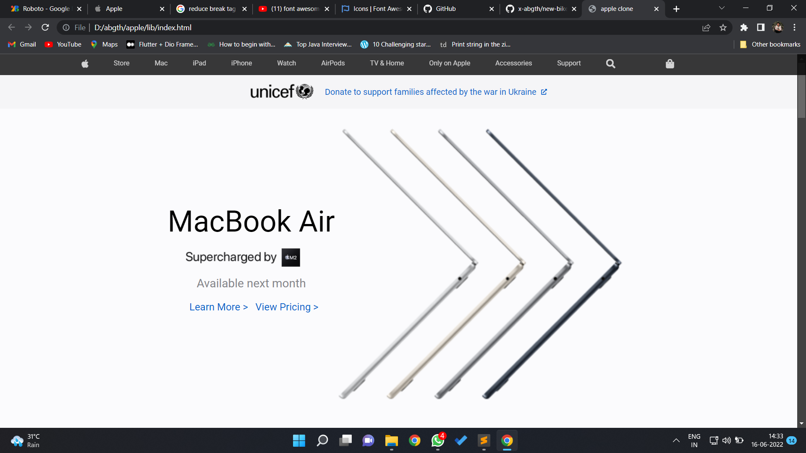

# Apple web application clone
This is a clone application of [Apple](https://www.apple.com/) website, made for educational purpose only.
<br><br>
>This application is only developed on front end and currently not responsive.

## ✍ To dos
- [ ] Make website responsive

## 📱 Screenshots
 
 
 
 
 
 
 

## 💻 Test application on your machine
Open CMD from where you want to clone the project & run the following commands:
```
  git clone https://github.com/x-abgth/apple-web-clone.git
```
```
  cd apple-web-clone/lib/index.html
 ```
 
## ❤ Conclusion
🌟 Star this repo & follow for more 😊
